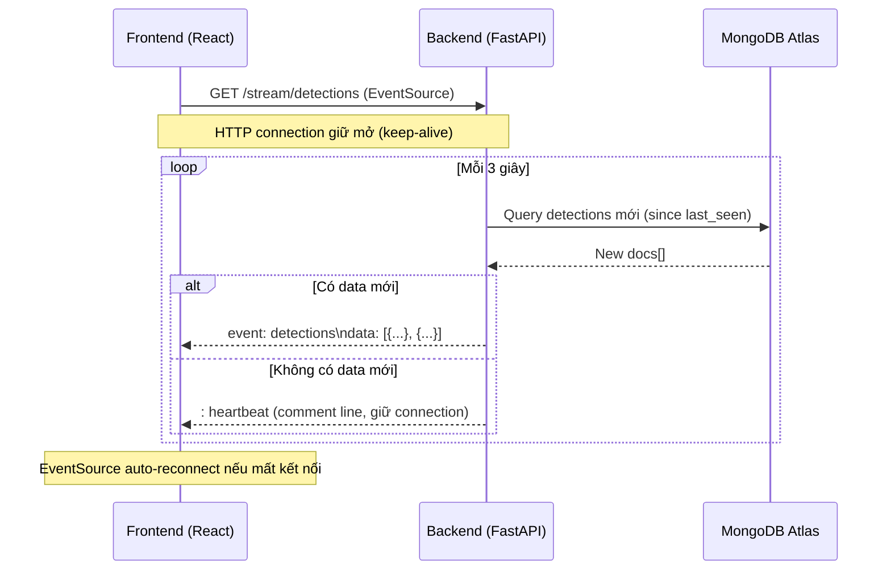

# Chuyển từ Polling sang SSE (Server-Sent Events)

## Mục tiêu

Thay thế cơ chế `setInterval` polling 5s hiện tại bằng **Server-Sent Events (SSE)** để Frontend nhận detections mới từ Backend qua một kết nối HTTP duy trì liên tục. Giảm latency từ ~15s xuống ~3s và loại bỏ hoàn toàn vấn đề database pressure khi scale nhiều client.

## Kiến trúc mới



## Thay đổi so với hiện tại

| Aspect | Polling (hiện tại) | SSE (mới) |
|--------|--------------------|-----------| 
| **Connection** | Mở/đóng mỗi 5s | 1 connection duy trì |
| **Latency** | ~15s worst case | ~3s worst case |
| **DB queries** | N clients × 12/phút | 1 query / 3s (server-side loop) |
| **Network overhead** | HTTP headers mỗi request | Chỉ data payload |
| **Auto-reconnect** | Built-in (interval) | EventSource tự reconnect |

> [!IMPORTANT]
> Endpoint `/live-detections` (GET cũ) **vẫn giữ nguyên** để backward compatible. SSE là endpoint mới `/stream/detections`.

---

## Proposed Changes

### Backend — FastAPI SSE Endpoint

#### [MODIFY] [Main.py](file:///c:/Users/phucn/OneDrive/Documents/Flash-Loan-Attack-Detection/backend/Main.py)

Thêm endpoint SSE mới `/stream/detections`:

```python
import asyncio
import json
from fastapi.responses import StreamingResponse

@app.get("/stream/detections")
async def stream_detections():
    """SSE endpoint — stream flash loan detections to frontend."""
    
    async def event_generator():
        last_seen_hash = None
        while True:
            try:
                docs = get_recent_detections(50)
                detections = [
                    {
                        "tx_hash":       d.get("tx_hash", "0x000"),
                        "is_suspicious": True,
                        "confidence":    d.get("confidence", "LOW"),
                        "cycle_path":    d.get("cycle_path", []),
                        "amount_usd":    float(d.get("amount_usd", 0)),
                        "total_usd":     float(d.get("total_usd", 0)),
                        "protocol":      d.get("protocol", "Unknown"),
                        "timestamp":     int(d.get("timestamp", 0)),
                        "from":          d.get("from", ""),
                        "token":         d.get("token", ""),
                    }
                    for d in docs
                ]

                current_hash = detections[0]["tx_hash"] if detections else None

                if current_hash != last_seen_hash:
                    # Có data mới → gửi full snapshot
                    yield f"event: detections\ndata: {json.dumps(detections)}\n\n"
                    last_seen_hash = current_hash
                else:
                    # Không có data mới → heartbeat giữ connection
                    yield ": heartbeat\n\n"

            except Exception as e:
                yield f"event: error\ndata: {json.dumps({'error': str(e)})}\n\n"

            await asyncio.sleep(3)  # Check MongoDB mỗi 3s

    return StreamingResponse(
        event_generator(),
        media_type="text/event-stream",
        headers={
            "Cache-Control": "no-cache",
            "Connection": "keep-alive",
            "X-Accel-Buffering": "no",  # Nginx proxy bypass
        },
    )
```

**Ưu điểm:**
- Chỉ có **1 query/3s tới MongoDB** bất kể số lượng client (vì mỗi client dùng chung 1 generator loop).
- FastAPI `StreamingResponse` native — không cần thêm dependency (không cần `sse-starlette`).
- Backward compatible — endpoint `/live-detections` cũ vẫn hoạt động.

---

### Frontend — EventSource thay thế Polling

#### [MODIFY] [HomePage.tsx](file:///c:/Users/phucn/OneDrive/Documents/Flash-Loan-Attack-Detection/frontend/src/pages/HomePage.tsx)

Thay toàn bộ `useEffect` polling bằng `EventSource`:

```tsx
useEffect(() => {
  const eventSource = new EventSource(`${API_URL}/stream/detections`);

  eventSource.addEventListener("detections", (event) => {
    const data: Detection[] = JSON.parse(event.data);
    setDetections(data);
  });

  eventSource.onerror = () => {
    console.warn("SSE connection lost, auto-reconnecting...");
    // EventSource tự reconnect, không cần xử lý thêm
  };

  return () => eventSource.close();
}, []);

// Auto-select first transaction (tách riêng)
useEffect(() => {
  if (detections.length > 0 && !selectedTx) {
    setSelectedTx(detections[0]);
  }
}, [detections]);
```

**Thay đổi:**
- Xóa `setInterval` + `fetch` polling
- Dùng `EventSource` API (browser native, không cần thêm lib)
- Fix bug `[selectedTx]` dependency → tách thành 2 `useEffect` riêng
- Fix comment sai "Poll Redis"

---

## Open Questions

> [!IMPORTANT]
> **Q1:** Có muốn giữ endpoint `/live-detections` (GET cũ) không? Mình recommend giữ để backward compatible + dùng cho `/decode` page.

> [!NOTE]
> **Q2:** Mỗi SSE client sẽ có **1 async generator riêng** → mỗi client vẫn query MongoDB riêng. Nếu muốn tối ưu hơn (1 query shared cho tất cả clients), cần thêm in-memory cache hoặc pub/sub pattern. Có cần implement cái đó không, hay scope hiện tại đủ rồi?

---

## Verification Plan

### Automated Tests
1. Start backend: `uvicorn backend.Main:app --host 0.0.0.0 --port 8000`
2. Test SSE bằng `curl`:
   ```bash
   curl -N http://localhost:8000/stream/detections
   ```
   → Expect nhận `event: detections` hoặc `: heartbeat` mỗi 3s
3. Test frontend: mở browser → Dashboard tự cập nhật mà không thấy polling requests trong DevTools Network

### Manual Verification
- Kiểm tra DevTools Network tab: chỉ có **1 request** duy nhất (`EventSource`) thay vì nhiều fetch requests lặp lại mỗi 5s
- Kiểm tra khi ngắt/nối lại network → EventSource auto-reconnect
